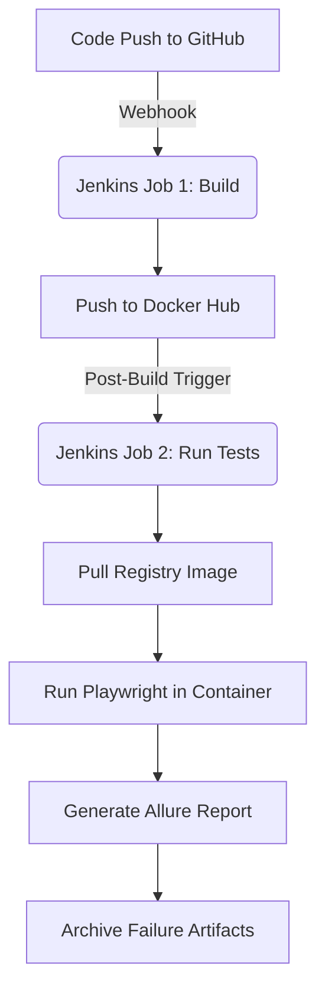
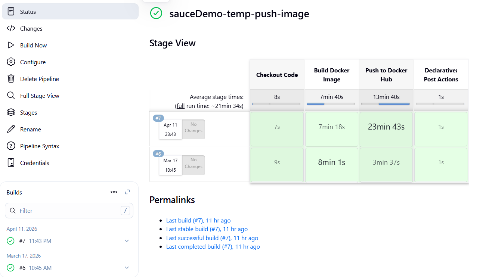
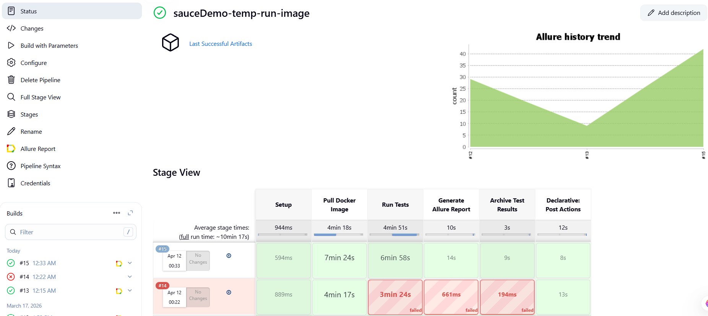
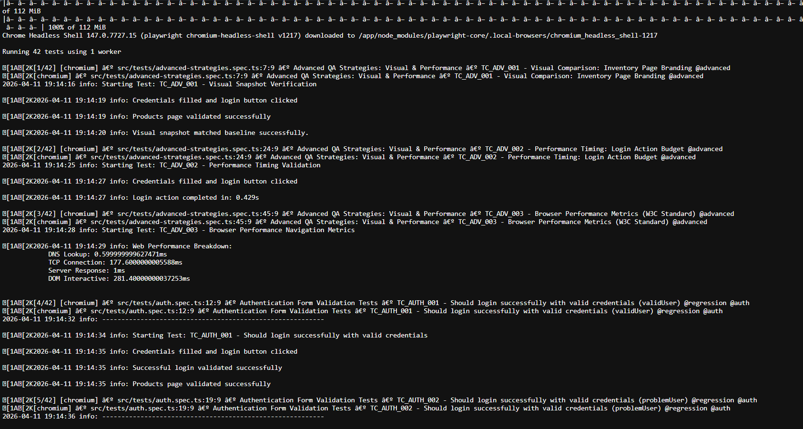
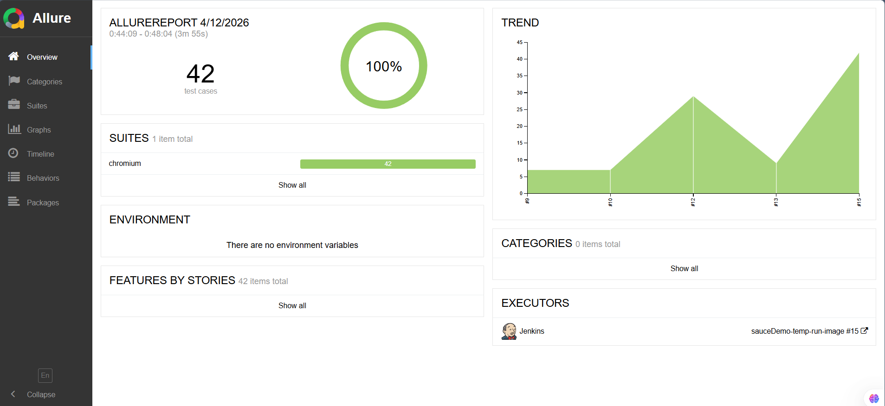
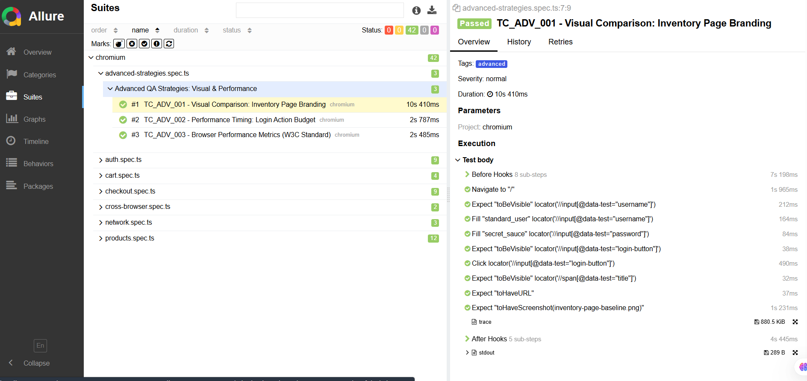

# SauceDemo Automation Framework: Technical Documentation 🚀

**Project Title:** End-to-End Test Automation Suite for SauceDemo  
**Author:** QA Automation Engineer  
**Technology Stack:** Playwright (TypeScript) | Jenkins | Docker | Allure | Winston  
**Repository:** [Dasun169/sauce-demo-playwright](https://github.com/Dasun169/sauce-demo-playwright)  
**Version:** 1.0.0

---

## 1. 📖 Title and Description
The **SauceDemo Automation Suite** is a containerized, cross-browser testing framework designed to validate critical user journeys of the SauceDemo e-commerce platform. The framework implements enterprise-grade testing strategies including Page Object Model (POM), Data-Driven Testing (DDT), Network Interception, Visual Regression, and Performance Budgeting.

### ✨ Key Features
| Feature | Description |
| :--- | :--- |
| **Page Object Model (POM)** | Maintainable, reusable page classes with TypeScript typing. |
| **Data-Driven Testing (DDT)** | Externalized JSON/TS data for users, products, and checkout scenarios. |
| **CI/CD Integration** | Two-stage Jenkins pipeline with Docker containerization. |
| **Advanced Reporting** | Allure Reports with screenshots, traces, and videos on failure. |
| **Network Resilience** | Mocking and interception of API requests (500 errors, asset failures). |
| **Cross-Browser Coverage** | Chromium, Firefox, WebKit, plus Mobile Chrome & Safari. |
| **Performance Testing** | W3C Navigation Timing API + custom performance budgets. |
| **Visual Regression** | Pixel-perfect screenshot comparison with baseline images. |

---

## 2. 🏗️ Project Structure
The framework follows a clean, modular architecture separating concerns between tests, page objects, data, and utilities.

```text
sauce-demo-playwright/
│
├── configs/
│   └── .env.stag                 # Environment variables (BASE_URL, credentials)
│
├── fixtures/
│   └── fixture.ts                # Custom Playwright fixtures (page objects, auth state)
│
├── reports/
│   ├── playwright-report/        # HTML report (Playwright native)
│   ├── allure-report/            # Allure report directory
│   │   ├── allure-results/       # Raw test results (JSON/XML)
│   │   └── html/                 # Generated Allure dashboard
│   └── json-report/              # JSON execution results
│
├── src/
│   ├── pages/                    # Page Object Models
│   │   ├── LoginPage.ts
│   │   ├── ProductsPage.ts
│   │   ├── CartPage.ts
│   │   └── CheckoutPage.ts
│   │
│   ├── test-data/                # Data-Driven Testing files
│   │   ├── authData.ts           # User credentials (standard, locked, problem)
│   │   ├── checkoutData.ts       # Personal info + negative scenarios
│   │   ├── filterData.ts         # Sort options (A-Z, Z-A, price)
│   │   └── itemData.ts           # Product names, prices, descriptions
│   │
│   ├── tests/                    # Test spec files (7 suites)
│   │   ├── auth.spec.ts          # 9 authentication tests
│   │   ├── cart.spec.ts          # 4 cart management tests
│   │   ├── checkout.spec.ts      # 9 checkout flow tests
│   │   ├── products.spec.ts      # 12 inventory & product tests
│   │   ├── network.spec.ts       # 3 API/network interception tests
│   │   ├── cross-browser.spec.ts # 2 cross-device tests
│   │   └── advanced-strategies.spec.ts # 3 visual/performance tests
│   │
│   └── utils/
│       ├── images/               # Baseline snapshots (visual regression)
│       └── Logger.ts             # Winston logging utility
│
├── log/                          # Runtime logs (test-log.log)
├── playwright.config.ts          # Playwright configuration (5 projects)
├── Dockerfile                    # Container definition (Node 20 + Java 17)
├── Jenkinsfile                   # Pipeline as Code (Groovy)
├── package.json                  # Dependencies & 15+ test scripts
└── tsconfig.json                 # TypeScript configuration
```

---

## 3. 🚀 Prerequisites
Ensure the following are installed locally or available in the CI environment:

| Requirement | Version | Purpose |
| :--- | :--- | :--- |
| **Node.js** | v18+ or v20+ | JavaScript runtime |
| **npm** | v9+ | Package manager |
| **Docker** | 20.10+ | Containerized execution |
| **Jenkins** | 2.375+ | CI/CD orchestration (with Allure Plugin) |
| **Git** | 2.30+ | Version control |
| **Java** | 17 (in Docker) | Allure report generation |

### Local Installation Steps
```bash
# 1. Clone the repository
git clone https://github.com/Dasun169/sauce-demo-playwright.git
cd sauce-demo-playwright

# 2. Install dependencies
npm install

# 3. Install Playwright browsers
npx playwright install --with-deps
```

---

## 4. 🧪 Running Tests (Scripts & Commands)
The `package.json` defines 15+ npm scripts for flexible test execution across browsers, devices, and environments.

### Main Commands
| Command | Description |
| :--- | :--- |
| `npm run test:chrome:ci -- @smoke` | Run Chromium tests with specific tag (CI mode) |
| `npm run test:chrome:headed` | Run Chromium tests in headed mode |
| `npm run test:chrome:debug` | Debug mode with Playwright Inspector |
| `npm run test:firefox:ci` | Firefox execution |
| `npm run test:webkit:ci` | WebKit execution |
| `npm run test:mobile-chrome:ci` | Mobile Chrome (Pixel 5) |
| `npm run test:mobile-safari:ci` | Mobile Safari (iPhone 12) |

---

## 5. 📊 Allure Reports
Allure provides rich, interactive test reports with historical trends, categories, and detailed step-by-step execution.

### Allure Commands
| Command | Description |
| :--- | :--- |
| `npm run allure:clean` | Remove existing Allure reports |
| `npm run allure:generate` | Generate HTML from allure-results |
| `npm run allure:open` | Open generated report in browser |
| `npm run allure:serve` | Auto-generate and serve real-time report |

---

## 📝 6. Test Cases (Complete Inventory)

### 🔑 Authentication Tests
*File: `src/tests/auth.spec.ts`*
| Test Case ID | Description | Tags |
| :--- | :--- | :--- |
| TC_AUTH_001 | Validates successful login using standard_user credentials | @regression, @auth |
| TC_AUTH_002 | Validates successful login using problem_user | @regression, @auth |
| TC_AUTH_003 | Validates successful login using performance_glitch_user | @regression, @auth |
| TC_AUTH_004 | Validates the logout flow and session termination | @regression, @auth |
| TC_AUTH_005 | Verifies the "Locked Out" error message appears | @regression, @auth, @sanity |
| TC_AUTH_006 | Validates error message for invalid credentials | @regression, @auth, @sanity |
| TC_AUTH_007 | Validates error when Username is empty | @regression, @auth, @sanity |
| TC_AUTH_008 | Validates error when Password is empty | @regression, @auth, @sanity |
| TC_AUTH_009 | Validates error when both fields are blank | @regression, @auth, @sanity |

### 🛒 Cart Page Tests
*File: `src/tests/cart.spec.ts`*
| Test Case ID | Description | Tags |
| :--- | :--- | :--- |
| TC_CART_001 | Validates item details in cart match selection | @regression, @cart |
| TC_CART_002 | Verifies badge count updates as items are removed | @regression, @cart |
| TC_CART_003 | Validates "Continue Shopping" button functionality | @regression, @cart |
| TC_CART_004 | Validates navigation to checkout info screen | @regression, @cart |

### 💳 Checkout Flow Tests
*File: `src/tests/checkout.spec.ts`*
| Test Case ID | Description | Tags |
| :--- | :--- | :--- |
| TC_CHK_001 | Executes full end-to-end checkout flow | @regression, @checkout |
| TC_CHK_002 | DDT: Validates error when info fields are empty | @regression, @checkout |
| TC_CHK_003 | DDT: Validates error when First Name is missing | @regression, @checkout |
| TC_CHK_004 | DDT: Validates error when Last Name is missing | @regression, @checkout |
| TC_CHK_005 | DDT: Validates error when Postal Code is missing | @regression, @checkout |
| TC_CHK_006 | Verifies Overview (Step Two) totals and taxes | @regression, @checkout |
| TC_CHK_007 | Asserts order confirmation success messages | @regression, @checkout |
| TC_CHK_008 | Verifies cancellation returns user to Cart | @regression, @checkout |
| TC_CHK_009 | Verifies cancellation returns user to Inventory | @regression, @checkout |

### 📦 Products & Inventory Tests
*File: `src/tests/products.spec.ts`*
| Test Case ID | Description | Tags |
| :--- | :--- | :--- |
| TC_PROD_001 | Validates UI elements and default item count | @regression, @products |
| TC_PROD_002 | Verifies hamburger menu open/close behavior | @regression, @products |
| TC_PROD_003 | Validates navigation to "About" page | @regression, @products |
| TC_PROD_004 | Validates "Add to Cart" updates cart state | @regression, @products |
| TC_PROD_005 | Validates all sorting options (A-Z, Z-A, Price) | @regression, @products |
| TC_PROD_006 | Verifies footer and social media icons | @regression, @products |
| TC_PROD_007-009 | Validates Facebook, Twitter, LinkedIn URLs | @regression, @products |
| TC_PROD_010 | Sequential data validation of all 6 products | @regression, @products |
| TC_PROD_011 | Individual product detail page validation | @regression, @products |
| TC_PROD_012 | Sequential cart badge increment validation | @regression, @products |

### 🌐 Network & API Simulation Tests
*File: `src/tests/network.spec.ts`*
| Test Case ID | Description | Tags |
| :--- | :--- | :--- |
| TC_NET_001 | Aborts image requests to verify UI resilience | @regression, @network |
| TC_NET_002 | Mocks 500 status code for inventory page | @regression, @network |
| TC_NET_003 | Intercepts CSS to modify UI appearance | @regression, @network |

### 📱 Cross-Browser & Viewport Tests
*File: `src/tests/cross-browser.spec.ts`*
| Test Case ID | Description | Tags |
| :--- | :--- | :--- |
| TC_CB_001 | Purchase flow across different browser engines | @regression, @cross-browser |
| TC_CB_002 | Mobile vs Desktop boundary validations | @regression, @cross-browser |

### 🚀 Advanced QA (Performance & Visual)
*File: `src/tests/advanced-strategies.spec.ts`*
| Test Case ID | Description | Tags |
| :--- | :--- | :--- |
| TC_ADV_001 | Visual Regression vs pixel-perfect baseline | @advanced |
| TC_ADV_002 | Performance Budget: Login within 3 seconds | @advanced |
| TC_ADV_003 | W3C Metrics: DNS, TCP, and Response timings | @advanced |

---

## 7. 📜 Logger (Winston Utility)
A centralized logging utility (`src/utils/Logger.ts`) provides structured, timestamped logs for auditing.

### Features
* **Log Levels:** info, error, debug, warn.
* **Transports:** Console (real-time) + File (`log/test-log.log`).
* **Format:** `YYYY-MM-DD HH:mm:ss level: message`.

---

## 🎭 8. Fixtures (Custom Playwright Fixtures)
Fixtures inject pre-configured page objects and shared state into tests, eliminating boilerplate.

**Benefits:**
* **Type Safety:** Full TypeScript autocompletion.
* **Clean Tests:** No manual instantiation of Page Objects.
* **Reusability:** Shared credentials and URLs.

---

## 🐳 9. Docker Setup: The Isolated Execution Environment
The `Dockerfile` is the blueprint for our containerized execution engine. It ensures that "it works on my machine" translates perfectly to "it works in CI."

### 🏗️ Base Environment: Node.js 20 & Java 17
*   **Node.js 20 (Slim):** We use the `node:20-slim` base image to maintain a lightweight footprint. Node 20 provides the Long Term Support (LTS) stability required for enterprise automation.
*   **Java 17 (OpenJDK):** While the tests are TypeScript, the **Allure Report Generator** is a Java-based utility. We install OpenJDK 17 specifically to transform raw JSON test results into the interactive HTML dashboard.

### 🐧 Browser Runtime Dependencies
Playwright browsers (Chromium, Firefox, WebKit) are not standalone binaries; they require specific Linux system libraries to render pages in "headless" mode.
*   **System Libraries:** We install `libnss3`, `libgbm1`, `libasound2`, and others via `apt-get`.
*   **Fonts Support:** We include `fonts-noto-color-emoji` to ensure that emojis and special characters render correctly during visual regression snapshots.

### ⚡ Optimized Build Strategy (Layer Caching)
To ensure fast build times in Jenkins, we implement **Layer Caching**:
1.  **Dependency Isolation:** We `COPY package*.json` and run `npm ci` *before* copying the rest of the source code.
2.  **Benefit:** If you only change a test file, Docker reuses the "npm install" layer from the cache, saving minutes of build time.

### 📁 Permissions & Directory Preparation
The Dockerfile pre-creates directory structures for `logs/`, `screenshots/`, and `allure-results/`.
*   **CHMOD 777:** We explicitly set global read/write permissions for these folders. This prevents "Permission Denied" errors when the Jenkins agent (running as a different user) tries to mount volumes and retrieve reports from the container.

### 🔧 Key Environment Variables
*   `PLAYWRIGHT_BROWSERS_PATH=0`: Ensures browsers are installed in a standard, predictable location within the image.
*   `JAVA_HOME`: Correctly pointed to the OpenJDK 17 path so the Allure CLI can find the JVM.

---

## 🏗️ 10. Pipeline Architecture (Jenkins + Docker)
The CI/CD strategy is split into two specialized Jenkins jobs to maintain a fast, scalable, and decoupled workflow.

### 🐳 Job 1: Infrastructure Build (The "Golden Image")
**Purpose:** To package the entire test environment (OS, Browsers, Java, Node, Source Code) into a single, immutable Docker image.

**Workflow Stages:**
1.  **Trigger:** A webhook from GitHub triggers this job on every push to `main` or `release` branches.
2.  **SCM Checkout:** Jenkins pulls the latest source code.
3.  **Docker Build:** Executes `docker build`. This installs Linux dependencies, Playwright browsers, and `npm` packages inside the container.
4.  **Registry Push:** Tags the image (e.g., `v1.0.0` or `latest`) and pushes it to **Docker Hub**. This image is now ready to be pulled by any execution agent.

---

### 🧪 Job 2: Test Execution & Advanced Intelligence
**Purpose:** To run actual tests against specific targets using the image built in Job 1.

**Execution Parameters:**
*   `TEST_TAG`: Filter tests (e.g., `@smoke`, `@regression`).
*   `PROJECT`: Select browser (e.g., `chromium`, `Mobile Chrome`).

**Workflow Stages:**
1.  **Workspace Prep:** preparation of local directories like `log/` and `allure-results/` on the Jenkins agent.
2.  **Image Pull:** Jenkins pulls the latest "Golden Image" from Docker Hub. 
3.  **Dynamic Container Run:** The container is started with **Volume Mounts** (`-v`). Critical reports/logs are mapped back to the Jenkins agent.
4.  **Playwright Execution:** Runs the command: `npx playwright test --grep $TEST_TAG --project=$PROJECT`.
5.  **Report Generation:** The **Allure Plug-in** gathers results and generates the interactive HTML dashboard.
6.  **Cleanup:** Executes `docker system prune` to ensure agent disk health.

---

### 🔄 Summary Workflow Diagram


---

## 📸 11. Visual Walkthrough & Artifacts

### 🐳 Job 1: Infrastructure Deployment (Push to Registry)
This stage demonstrates the automated build and secure push of the "Golden Image" to the container registry, ensuring all browser dependencies and source snapshots are versioned.


### 🧪 Job 2: Containerized Execution & Result Gathering
The secondary job pulls the specific image tag and spins up a short-lived container to execute the regression suite across configured browser parameters.


### 📄 Persistent Execution Logs (Winston Artifacts)
Winston logs are streamed from the container back to the Jenkins host agent and archived. This ensures that a complete audit trail of every database interaction and page navigation is available post-run.


### 📊 Allure Reporting: Executive Dashboard
The Allure dashboard simplifies test result analysis with dynamic graphs, historical trends, and category-based defect classification.


### 🐞 Allure Reporting: Granular Debugging & Traceability
Deep-dive into individual test failures with integrated screenshots, action-by-action steps, and timing metrics to significantly reduce Mean Time to Repair (MTTR).


---

## 📊 12. Summary & Deliverables
* **42 Test Cases** across 7 spec files.
* **15+ npm scripts** for flexible execution.
* **5 Browser projects** (Chromium, Firefox, WebKit, Mobile Chrome, Mobile Safari).
* **Docker & Jenkins** integration for enterprise-grade CI/CD.
* **Visual & Performance** automated validation.
